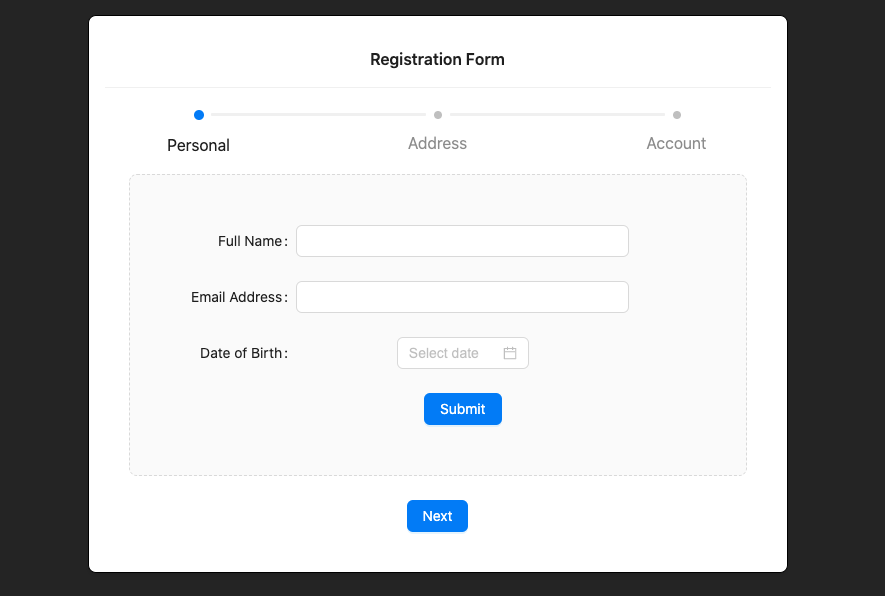

# Multi-Step Registration Form with React, Ant Design, Formik, and Yup

This project is a web application that implements a multi-step registration form using various technologies:

- **React**: A JavaScript library for building responsive and dynamic user interfaces (UI).

- **Ant Design**: A UI design framework that offers ready-to-use UI components to enhance the appearance and interactions of the application.

- **Formik**: A library that facilitates form management in React, including state handling, validation, and data submission.

- **Yup**: A JavaScript validation library used for confirming and validating user input data on the client side.

## Features

### Step 1: Personal Information

In the first step, users are required to provide their personal information, including:

- **Full Name**: This field is mandatory and cannot be left empty. An error message will be displayed if it's left empty.

- **Email Address**: This field is also mandatory and must contain a valid email address. Yup is used to validate the email format.

- **Date of Birth**: This field is mandatory and undergoes date validation to ensure it matches the expected format.

### Step 2: Address Information

The second step collects the user's address details, including:

- **Street Address**: Users must provide their street address, and this field is mandatory.

- **City**: The name of the city is required and must be filled out.

- **State**: Users must specify their state or province, and this field is also mandatory.

- **Zip Code**: The zip code is mandatory and should adhere to the expected format.

### Step 3: Account Information

In the third step, users are prompted to create their account information, including:

- **Username**: The username is a required field and must be filled out.

- **Password**: Users must enter a password, which is also mandatory and must meet specific security requirements, such as a minimum length of 8 characters with a combination of letters and numbers.

## Usage of Ant Design Components

This project leverages Ant Design components to design the user interface and interactions. Ant Design provides pre-built UI components that enhance the professional look and feel of the application.

## Client-Side Validation Implementation

Formik and Yup work in tandem to implement client-side validation. This means that users receive error messages as they fill out the form incorrectly, ensuring that the data sent to the server is valid before completing the registration process.

## Multi-Step Navigation

The project offers users the ability to navigate between form steps. Users can easily return to a previous step to make corrections if necessary, providing a better user experience and reducing errors in form completion.

In summary, this project is a web application that simplifies the registration process for users by guiding them through predefined steps, requiring valid information, and providing helpful feedback throughout the process.
 

[try me!](deft-biscuit-fdfac8.netlify.app)
